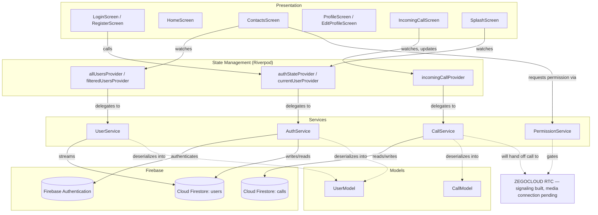
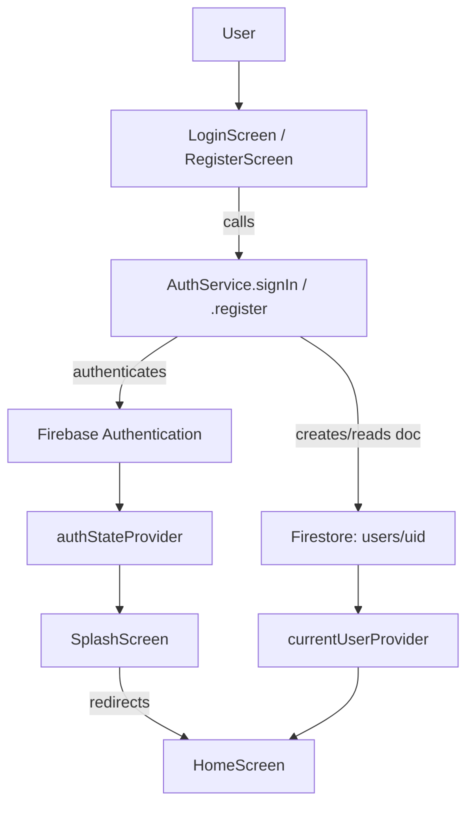
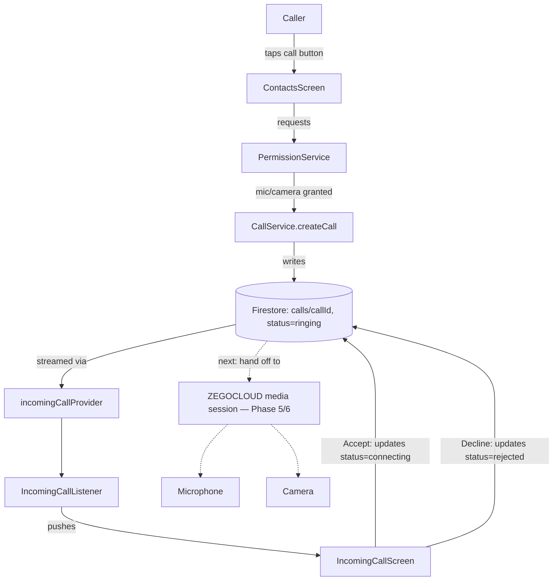
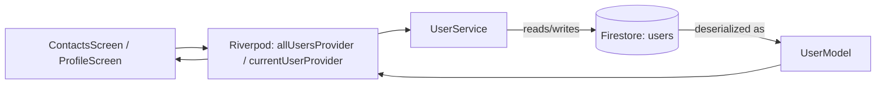
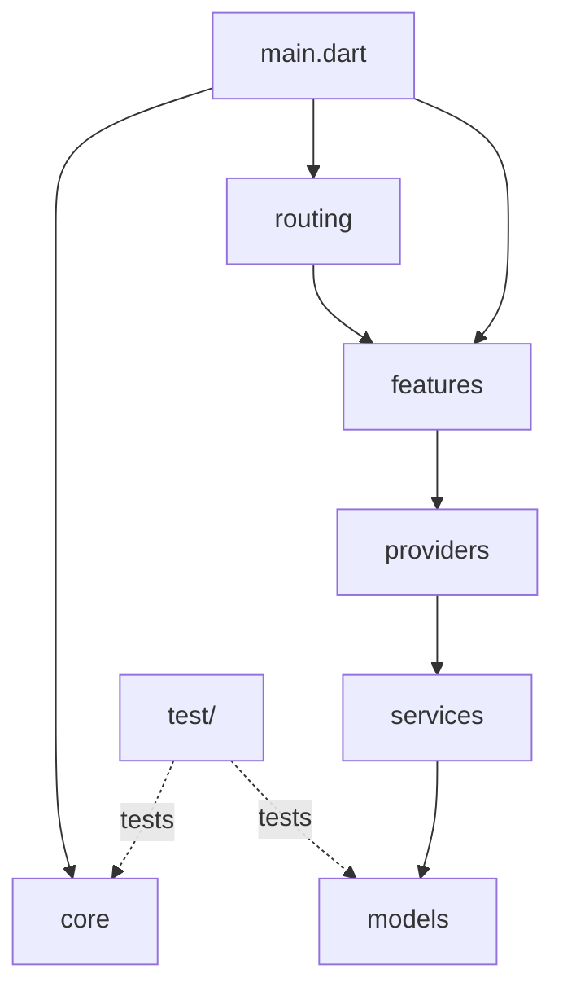

# ConnectCall

Real-time 1-to-1 audio and video calling app built with Flutter, Firebase, and ZEGOCLOUD.

## Overview

ConnectCall is a Flutter application implementing user authentication, a live contacts directory, and 1-to-1 call signaling backed by Firebase. It's built as a feature-first, layered Flutter app using Riverpod for state management and GoRouter for navigation.

## Key Features

- Email/password registration and login via Firebase Authentication
- Persistent auth state with automatic splash-screen redirect (`SplashScreen` watches `authStateProvider`)
- Live contacts list with search/filter (`ContactsScreen`, `UserService.watchAllUsers`)
- Online/offline status tracking on the user document
- Editable user profile (`EditProfileScreen`)
- Real-time call signaling via Firestore (`CallService`) with a documented call-state machine
- Global incoming-call detection (`IncomingCallListener`) that surfaces a full-screen incoming-call UI regardless of the active tab
- Runtime microphone/camera permission handling, including the permanently-denied → Settings path (`PermissionService`)
- Duplicate-call prevention (`CallService.hasActiveCallBetween`)
- Firestore security rules restricting user docs to their owner and call docs to their two participants

## Tech Stack

| Layer | Choice |
|---|---|
| Framework | Flutter / Dart |
| State management | flutter_riverpod |
| Routing | go_router |
| Auth | firebase_auth |
| Database | cloud_firestore |
| RTC (in progress) | zego_uikit_prebuilt_call |
| Permissions | permission_handler |
| Config | flutter_dotenv |

**Why these choices:** Riverpod keeps business logic out of widgets and testable without a `BuildContext` — see `test/core_unit_test.dart`, which unit-tests `Validators` and `UserModel` with zero Flutter dependencies. GoRouter centralizes routes in one table (`AppRoutes`) instead of scattered `Navigator.push` calls. Firebase Auth + Firestore avoid hand-rolling a backend for what's fundamentally an auth + document-store problem. ZEGOCLOUD was selected for its prebuilt Flutter call UI, reducing custom RTC plumbing.

## Architecture



### Authentication Flow



### Call Signaling Flow (current implementation)



### User Data Flow



### Project Structure



```text
lib/
├── main.dart
├── core/
│   ├── constants/        # app_constants.dart, zego_config.dart
│   ├── theme/             # app_theme.dart
│   └── utils/             # validators.dart
├── features/
│   ├── auth/              # login_screen.dart, register_screen.dart
│   ├── calling/           # incoming_call_screen.dart, incoming_call_listener.dart
│   ├── contacts/          # contacts_screen.dart, widgets/user_tile.dart
│   ├── home/              # home_screen.dart
│   ├── profile/           # profile_screen.dart, edit_profile_screen.dart
│   └── splash/            # splash_screen.dart
├── models/                # user_model.dart, call_model.dart
├── providers/             # auth_providers.dart, user_providers.dart, call_providers.dart
├── routing/               # app_router.dart
└── services/              # auth_service.dart, user_service.dart, call_service.dart, permission_service.dart

test/
└── core_unit_test.dart    # Validators + UserModel unit tests
```

## Environment Configuration

RTC credentials are loaded at runtime via `flutter_dotenv`, never hardcoded.

`.env.example` (committed):
```env
ZEGO_APP_ID=
ZEGO_APP_SIGN=
```

Create your own `.env` (gitignored) with real values before running the app. `ZegoConfig` (`lib/core/constants/zego_config.dart`) throws a clear error at startup if these are missing.

## Firebase Setup

1. Create a project at [console.firebase.google.com](https://console.firebase.google.com)
2. Enable **Authentication → Email/Password**
3. Create a **Cloud Firestore** database
4. Run `flutterfire configure` from the project root to generate `lib/firebase_options.dart` and `android/app/google-services.json`
5. Deploy security rules and indexes:


## ZEGOCLOUD Setup

1. Create a project at [console.zegocloud.com](https://console.zegocloud.com)
2. Copy the **AppID** and **AppSign** into your local `.env`

## Android Permissions

Declared in `android/app/src/main/AndroidManifest.xml`: `INTERNET`, `RECORD_AUDIO`, `CAMERA`, `MODIFY_AUDIO_SETTINGS`, `BLUETOOTH`, `BLUETOOTH_CONNECT`, `ACCESS_NETWORK_STATE`, `ACCESS_WIFI_STATE`. Runtime requests and denial handling (including permanently-denied → Settings) are implemented in `PermissionService`.

## Installation & Running Locally

```bash
git clone <repo-url>
cd connectcall
cp .env.example .env   # fill in your ZEGOCLOUD credentials
flutterfire configure   # generates firebase_options.dart + google-services.json
flutter pub get
flutter run
```

## Testing

```bash
flutter analyze   # No issues found!
flutter test      # 6 tests passed — Validators + UserModel, no Firebase mocking required
```

## Current Implementation Status

**Working end-to-end:**
- Registration, login, logout, persistent auth state
- Live contacts list with search
- Profile view and edit
- Firestore-backed call signaling: call creation, ringing state, global incoming-call popup, accept/reject state transitions, duplicate-call prevention
- Runtime mic/camera permission flow

**In progress:**
- Actual ZEGOCLOUD audio/video media connection (the call document lifecycle is real; the live media session on accept is the next implementation phase)
- Call history UI
- Background/killed-app incoming call notifications (app-open-only for now)
- Profile photo upload (requires Firebase Storage, not yet configured)

## Known Limitations

- Contacts list is unpaginated — fine at assignment scale, would need pagination for production
- Presence (`isOnline`) is set on login/logout only, not a continuous heartbeat
- No push notifications yet, so incoming calls only surface while the app is open

## Security Considerations

- Firestore rules (`firestore.rules`) restrict `users/{uid}` writes to the document owner and `calls/{callId}` reads/writes to the two participants
- No secrets committed: `.env`, `google-services.json`, and keystores are gitignored; `.env.example` ships placeholders only
- ZEGOCLOUD AppSign is loaded from environment config, never hardcoded in source

## AI Disclosure

AI tools were used for architecture guidance, implementation assistance, debugging, and documentation. All generated code was reviewed and tested against a real Firebase project and Android emulator as part of development.
