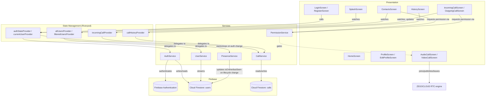
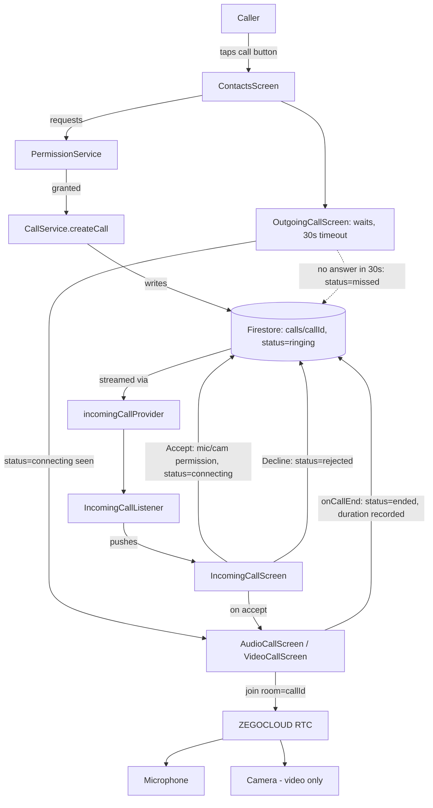
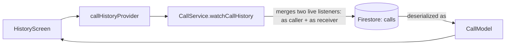

# ConnectCall

Real-time 1-to-1 audio and video calling app built with Flutter, Firebase, and ZEGOCLOUD.

## Overview

ConnectCall is a Flutter application implementing user authentication, a live contacts directory, real-time 1-to-1 audio and video calling, and call history — all backed by Firebase and ZEGOCLOUD. Built as a feature-first, layered Flutter app using Riverpod for state management and GoRouter for navigation.

## Key Features

- Email/password registration and login via Firebase Authentication
- Persistent auth state with automatic splash-screen redirect
- Live contacts list with search/filter
- Real online/offline presence based on app lifecycle state (not a static flag)
- Editable user profile
- **Real-time 1-to-1 audio calling** — verified working end-to-end between two physical/emulated devices
- **Real-time 1-to-1 video calling** — verified working end-to-end between two physical/emulated devices
- Global incoming-call detection that surfaces a full-screen incoming-call UI regardless of the active tab
- Accept / decline / cancel / 30-second no-answer (missed) call states
- Runtime microphone/camera permission handling, including permanently-denied → Settings
- Duplicate-call prevention
- Live, merged call history (as caller and as receiver) with direction, duration, and missed/declined labeling
- Dark mode (follows system theme)
- Firestore security rules restricting user docs to their owner and call docs to their two participants

## Tech Stack

| Layer | Choice |
|---|---|
| Framework | Flutter / Dart |
| State management | flutter_riverpod |
| Routing | go_router |
| Auth | firebase_auth |
| Database | cloud_firestore |
| RTC | zego_uikit_prebuilt_call (v4) |
| Permissions | permission_handler |
| Config | flutter_dotenv |

**Why these choices:** Riverpod keeps business logic out of widgets and testable without a `BuildContext` — see `test/core_unit_test.dart`. GoRouter centralizes routes in one table instead of scattered `Navigator.push` calls. Firebase Auth + Firestore avoid hand-rolling a backend. ZEGOCLOUD was chosen for its prebuilt Flutter call UI, cutting custom RTC plumbing to a minimum while still giving real, verified two-way audio/video.

## Architecture



### Call Flow (Audio & Video)



### Call History Data Flow



### Project Structure

```text
lib/
├── main.dart
├── core/
│   ├── constants/        # app_constants.dart, zego_config.dart
│   ├── theme/             # app_theme.dart
│   └── utils/             # validators.dart
├── features/
│   ├── auth/              # login_screen.dart, register_screen.dart
│   ├── calling/           # audio_call_screen.dart, video_call_screen.dart,
│   │                      # incoming_call_screen.dart, outgoing_call_screen.dart,
│   │                      # incoming_call_listener.dart
│   ├── contacts/          # contacts_screen.dart, widgets/user_tile.dart
│   ├── history/           # history_screen.dart, widgets/call_history_tile.dart
│   ├── home/              # home_screen.dart
│   ├── profile/           # profile_screen.dart, edit_profile_screen.dart
│   └── splash/            # splash_screen.dart
├── models/                # user_model.dart, call_model.dart
├── providers/             # auth_providers.dart, user_providers.dart, call_providers.dart
├── routing/               # app_router.dart
└── services/              # auth_service.dart, user_service.dart, call_service.dart,
                            # permission_service.dart, presence_service.dart

test/
└── core_unit_test.dart    # Validators, UserModel, CallModel unit tests
```

## Environment Configuration

RTC credentials are loaded at runtime via `flutter_dotenv`, never hardcoded.

`.env.example` (committed):
```env
ZEGO_APP_ID=
ZEGO_APP_SIGN=
```

Create your own `.env` (gitignored) with real values. `ZegoConfig` throws a clear startup error if these are missing.

## Firebase Setup

1. Create a project at [console.firebase.google.com](https://console.firebase.google.com)
2. Enable **Authentication → Email/Password**
3. Create a **Cloud Firestore** database
4. Run `flutterfire configure` to generate `lib/firebase_options.dart` and `android/app/google-services.json`
5. Deploy rules and indexes:

## ZEGOCLOUD Setup

1. Create a project at [console.zegocloud.com](https://console.zegocloud.com)
2. Copy the AppID and AppSign into your local `.env`

## Android Permissions

`INTERNET`, `RECORD_AUDIO`, `CAMERA`, `MODIFY_AUDIO_SETTINGS`, `BLUETOOTH`, `BLUETOOTH_CONNECT`, `ACCESS_NETWORK_STATE`, `ACCESS_WIFI_STATE`. Runtime request/denial handling (including permanently-denied → Settings) is in `PermissionService`.

## Installation & Running Locally

```bash
git clone <repo-url>
cd connectcall
cp .env.example .env   # fill in ZEGOCLOUD credentials
flutterfire configure
flutter pub get
flutter run
```

## Testing

```bash
flutter analyze
flutter test
```

## Current Implementation Status

**Working and verified on two real/emulated devices:**
- Registration, login, logout, persistent auth state
- Live contacts list with search
- Profile view and edit
- Real-time 1-to-1 **audio calling** — two-way audio confirmed working
- Real-time 1-to-1 **video calling** — two-way video confirmed working
- Full call lifecycle: ringing, accept, reject, cancel, 30s no-answer/missed, end-call cleanup on both sides
- Live call history (merged caller+receiver view)
- Runtime mic/camera permission flow
- Lifecycle-based presence (online/offline)
- Dark mode

**Not implemented (documented, not faked):**
- Background/killed-app incoming call push notifications (app-open-only delivery)
- Profile photo upload (requires Firebase Storage, not configured)
- Network-quality indicator, group calling, screen sharing, call recording, block user

## Known Limitations

- **Presence**: Firestore has no server-side `onDisconnect` hook (unlike Realtime Database), so a force-killed app or hard crash can leave a user shown "Online" until their next lifecycle event. Documented in `presence_service.dart`.
- Contacts list is unpaginated — fine at assignment scale.
- No push notifications, so incoming calls only surface while the app is open.
- Ring timeout (30s) is client-side only; a caller whose app is killed before it fires can leave a stale "ringing" doc with no server-side cleanup job.
- No reconnection UI on network drop beyond the ZEGOCLOUD SDK's own internal handling.

## Security Considerations

- Firestore rules restrict `users/{uid}` writes to the owner and `calls/{callId}` reads/writes to the two participants
- No secrets committed: `.env`, `google-services.json`, keystores are gitignored; `.env.example` ships placeholders only
- ZEGOCLOUD AppSign loaded from environment config, never hardcoded.
